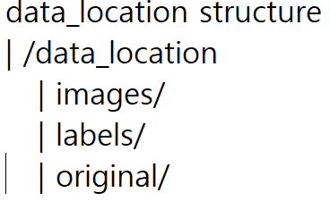
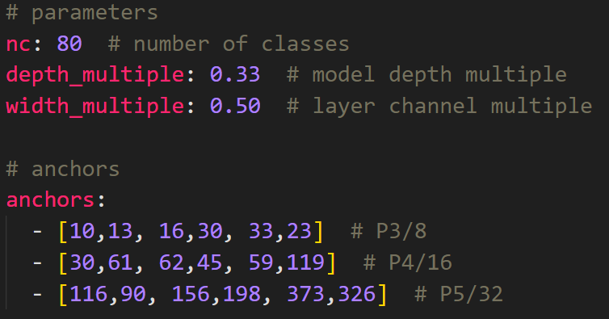

# YOLOv5 Custom Data 학습을 위한 코드, 명령어 모음

### 1.데이터 수집
- [capture.py](./capture.py)
---

### 2. 이미지 Rename, Resize
파일명이 규칙성 없이 지저분하다면 일괄되게 Rename해주는 것이 후처리할 때 편함.
- [resize_rename.py](./resize_rename.py)
---
### 3. 데이터 증강
#### 데이터 디렉토리 구조
</img>


- [xml2txt.py](./xml2txt.py) : xml형식의 Label File을 txt형식으로 변환

- [augmentation.py](./augmentation.py) : xml형식의 label을 갖는 데이터셋 증강

- [txt_aug.py](./txt_aug.py) : txt형식의 label을 갖는 데이터셋 증강
---
### 4. Train, Test Dataset 분할
- [custom_yolo.py](./custom_yolo.py)  :  데이터셋을 분할한 후 데이터셋 경로를 저장
! data.yaml 파일의 클래스 이름과 개수 `name , nc`  수정해주어야 함
>[data.yaml](./data.yaml)
---
### 5. 모델 Initial Setting
1. yolov5 디렉토리에서 `$ python3` 실행
2. 아래 명령어 입력  
_(클래스 개수 : n , data.yaml 파일 경로 : path)_
```python
>>> from utils.autoanchor import kmean_anchors
>>> _ = kmean_anchors(path='<data.yaml PATH>', 
                        n=?, img_size=640, thr=4.0, 
                        gen=1000, verbose=True)
>>> print(_)
```
위 명령어를 통해서 Custom Dataset에 최적화된 Anchor Box 크기를 구할 수 있다.\
*(Annotation BBox Size 클러스터링 알고리즘 적용)*\
\
3. 계산된 Anchor Box 값 `yolov5s_custom.yaml`파일에 적용

</img>
---
### 6. 모델 학습
*<> 제외하고 경로 입력*
```bash
$ python3 train.py --data <data.yaml_Path> --cfg <yolov5_custom.yaml_Path> --hyp <HyperParameter_Path.yaml> --weights <pretrained_model_Path.pt> --batch-size <32_or_64_or_128> --epoch 500 
```
---
### 7. 모델 확인
```bash
$ python3 detect.py --source <Trained_Weights_file_Path.pt> --source <Source_for_inference_Path> --conf <Confidence_Threshold>
```
---

# Reference

## YOLOv5
>[yolov5](https://github.com/ultralytics/yolov5)

## Labeling Tool
>[labelimg](https://github.com/tzutalin/labelImg)

## Image Augmentation
>[imgaug](https://github.com/aleju/imgaug)
